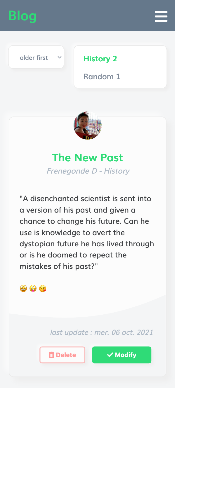
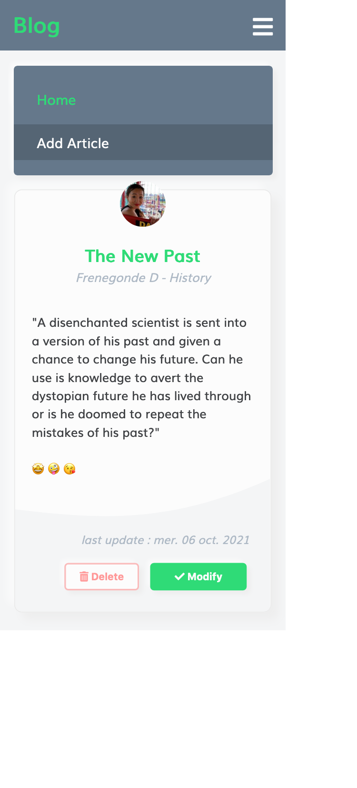
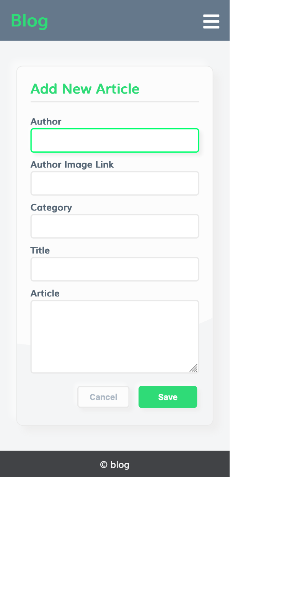
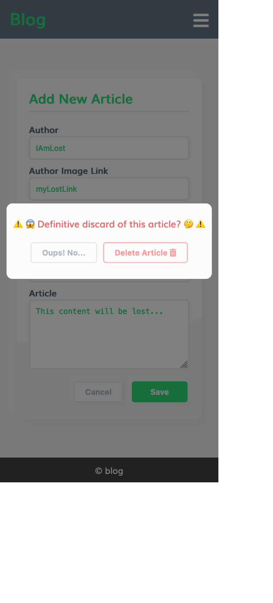
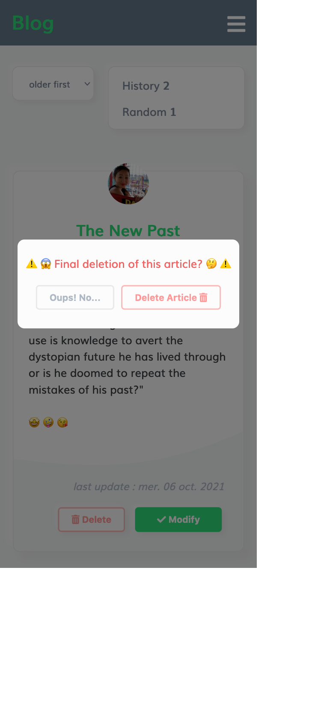

<h1 align="center">Just a from scratch blog exercice in Javascript 👋</h1>

### 🚀 [My Live Page](https://ipopop.github.io/dyma-fr-javascript-blog/)
---

> 🚀 😉 [**'examples.json'**](https://github.com/ipopop/dyma-fr-javascript-blog/blob/main/examples.json) \
 ...contains some sample articles to inspire you if you want to try this application quickly.

--- 
🙏  Thank's to '[**Dyma.fr**](https://dyma.fr)' for the lessons

---
## Author

👤 **eb-dev**

## Show your support

Give a ⭐️ if this project helped you!

## 📝 License

Copyright © 2021 [eb-dev](https://github.com/ipopop). 
This project is [MIT](https://en.wikipedia.org/wiki/MIT_License) licensed.

***
_This README was generated with ❤️ by [readme-md-generator](https://github.com/kefranabg/readme-md-generator)_